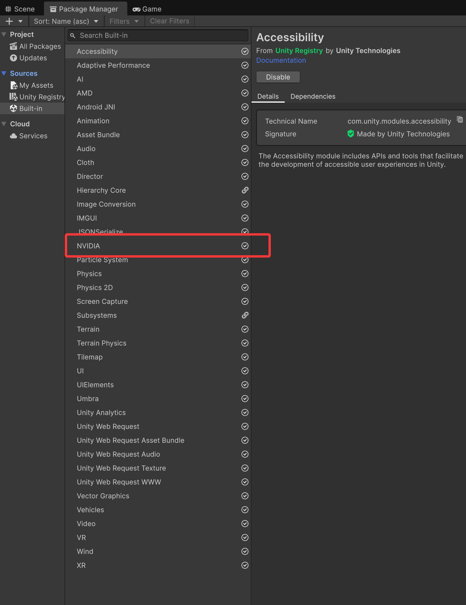

# Unity HDRP DLSS-NR

## 中文说明

这是一个面向 Unity HDRP 的 NVIDIA DLSS Neural Rendering 集成。它以 HDRP 正式
Custom Post Process Volume 运行，不需要 Renderer Feature，也不需要 Custom Pass。

### 功能

后处理从 HDRP 相机获取光栅颜色、深度和运动向量，交给 UnityRHI DLSS-NR 原生运行时，
再写回 HDRP 后处理链。已验证路径仍是相机实际尺寸下的 1x 神经图像增强；代码另外提供
一个需要显式启用的固定 2x `IUpscaler` 实验路径。2x 的实际画质和时序稳定性尚未在本项目
Game 窗口确认。它不是 DLSS Super Resolution、Frame Generation 或 Ray Reconstruction，
也不会生成另一张光线重构图。

### 效果对比

下图为 DLSS-NR 开启与关闭时的画面对比示例：


### 前置依赖

| 依赖 | 要求 | 地址 |
| --- | --- | --- |
| Unity | Unity 6.3 或更高版本 | [Unity 版本下载](https://unity.com/releases/editor/archive) |
| HDRP | HDRP 17 或更高版本，启用 RenderGraph | [HDRP 文档](https://docs.unity3d.com/6000.3/Documentation/Manual/com.unity.render-pipelines.high-definition.html) |
| UnityDLSSNR | 上游 UnityRHI managed/native 包，本仓库依赖它 | [Kuan-Mi/UnityDLSSNR](https://github.com/Kuan-Mi/UnityDLSSNR) |
| Managed 包 | `top.kuanmi.unityrhi` | [最新 Release](https://github.com/Kuan-Mi/UnityDLSSNR/releases/latest) |
| Native 包 | `top.kuanmi.unityrhi.native`，必须嵌入项目 | [native 1.0.0 下载](https://github.com/Kuan-Mi/UnityDLSSNR/releases/download/v1.0.0/top.kuanmi.unityrhi.native-1.0.0.zip) |
| Unity NVIDIA DLSS | 必须安装项目使用的 Unity HDRP NVIDIA DLSS 包/插件，并在相机上启用 DLSS | [HDRP DLSS 文档](https://docs.unity3d.com/Packages/com.unity.render-pipelines.high-definition@17.0/manual/DLSS.html) |
| NVIDIA | 支持 DLSS-NR 的 NVIDIA GPU、驱动和匹配的原生运行时 | [NVIDIA DLSS](https://developer.nvidia.com/dlss) |

Unity Package Manager 中应能看到已安装的 **NVIDIA** 模块：



平台仅支持 Windows x64 + Direct3D 12；不支持 D3D11、macOS、Linux 或非 NVIDIA 设备。

### 安装

1. 将本仓库的 `Core`、`HDRP`、`Shaders` 复制到目标项目的 `Assets/Plugins/DLSS 5`。
2. 安装 `top.kuanmi.unityrhi` managed 包。
3. 下载并解压 native 包到：

   ```text
   Packages/top.kuanmi.unityrhi.native
   ```

   native 包必须位于目标项目 `Packages` 下，不能直接引用外部 `Build` 文件夹；请自行
   通过合法、可信的渠道获取与驱动匹配的 NVIDIA DLSS-NR 原生运行时，并按上游项目
   的说明放入该包的插件目录。本仓库不包含、不分发也不提供泄露的 NVIDIA 二进制文件。
4. 在 **Edit > Project Settings > Player > Other Settings** 设置 **Direct3D 12**，
   重启 Unity。
5. 确认项目已安装并启用 Unity HDRP 的 NVIDIA DLSS 包/插件，并在使用的相机上勾选
   **Enable DLSS**（或项目对应版本中的同名 DLSS 开关）。这是本后处理的必要前置；
   如果相机没有启用 Unity/NVIDIA DLSS，后处理可能输出黑屏。
6. 在 **Edit > Project Settings > Graphics > HDRP Global Settings** 的
   **Custom Post Process Orders > After Post Process** 添加：

   ```text
   UnityRhi.DlssNr.Hdrp.DlssNrHdrpPostProcess
   ```

7. 在 Volume Profile 中选择 **Add Override > Post-processing > DLSS Neural Rendering**，
   勾选 **Enabled** override 并打开。确认 HDRP 相机启用 Depth 和 Motion Vectors。

Volume 面板示例：


默认不启用自定义 2x upscaler，因此原有 1x Game 渲染路径保持不变。

### 实验性固定 2x 启用

1. 脚本编译完成后选中当前使用的 HDRP Asset 一次，让 HDRP 创建
   `DlssNrUpscalerOptions` 子资源；其 Injection Point 必须是 **After Post**。如果子资源
   是在管线运行后才创建的，请重载或重启渲染管线。
2. 在该 HDRP Asset 中启用 **Dynamic Resolution** 和 **Force Resolution**，将
   **Forced Percentage** 设为 `50`，使 HDRP Asset 的显示配置与固定 2x 一致。真正的半宽、
   半高由 upscaler 自己协商，该界面数值不再参与 1x/2x 所有权判定。
3. 在 **Advanced Upscalers by Priority** 中添加 `DLSS Neural Rendering 2x`，并放在
   第 1 优先级。
4. 在 Game 相机上启用 **Allow Dynamic Resolution**。
5. 保持 DLSS Neural Rendering Volume 的 **Enabled** 开启、**Debug Mode** 为
   **Off**，并保持 HDRP Motion Vectors 开启。

只有这些显式条件同时成立时，旧 1x 后处理才会旁路，HDRP 输入宽高为目标宽高的一半，
native dispatch 才请求固定 2x 输出。若 native Create/Evaluate 失败，C# 路径保留一张
全输出尺寸的双线性 fallback，避免 D3D12 对异尺寸资源执行非法 `CopyResource`。

从第 1 优先级移除该 upscaler，或关闭 Dynamic Resolution、Force Resolution、相机
Allow Dynamic Resolution，即可回到原有 1x Volume 路径。2x 下的 Volume Debug Mode
当前会使用双线性 fallback；2x 画质、曝光、
抖动与运动中的时序稳定性仍是待实际验证项，不能视为已经确认。

### 参数与相机行为

- **Preset / Style**：神经渲染配置。
- **Intensity、Local Tone Strength、Local Structure Strength、Skin Structure Strength**：增强强度。
- **Motion Vector Scale**：运动向量到像素单位的换算。
- **Camera Cut Distance / Angle**：触发时域历史重置。
- **Use Auto Mask / UI Correction**：转发给 DLSS-NR 的选项。
- **Debug Mode**：查看运动向量、运动幅度、设备深度或线性眼空间深度。

Game 相机使用完整 DLSS-NR 路径。SceneView 当前直接显示 HDRP 原图（pass-through），
不执行 native DLSS-NR，以避免编辑器相机缺少稳定时域历史导致灰屏、黑屏或闪烁。因此
SceneView 不保证显示与 Game 窗口相同的 DLSS 效果，请在 Game 窗口或构建版本确认。

默认 HDRP 集成仍为单眼 1x native 路径：输入和输出尺寸相同，`Upscaling` 关闭。只有
上述严格配置才进入实验性固定 2x 路径。立体/XR Game 相机、HDR 输出或缺少有效输入资源
时会安全回退；这类旁路不会创建或复用单眼时域历史。分辨率变化、相机销毁和后处理清理
会在释放持久资源前等待 GPU 完成，以降低 native command stream 仍在使用旧资源时的
崩溃风险。

每个相机拥有独立 native context 和时域历史；分辨率、投影、相机切换或 Volume 参数
变化时会自动重置历史。

### 输入接口

当前 native dispatch 接收 `Color`、`Depth`、`MotionVectors`、输入/输出宽高、运动向量
缩放、深度反转、Reset、Preset/Style 以及强度参数。Normals、roughness、albedo、
reactive mask、exposure texture 和 ray-tracing buffers 不属于当前路径。

### 排错

- 黑屏/灰屏：确认 D3D12、Unity/NVIDIA DLSS 包已安装、相机上的 **Enable DLSS** 已开启、
  native 包路径、合法获取的原生运行时、Global Settings 注册和 Volume Enabled。
- Console 出现 URP `Core.hlsl`、`TextureDimension` 或 D3D11 错误：说明仍有旧 URP 文件或使用了错误图形 API。
- 画面裁切/偏移：检查 Game View 宽高比、相机 viewport 和 RTHandle scale，不要使用 backing texture 尺寸。
- 2x 没有进入 native：确认自定义 upscaler 位于第 1 优先级、相机允许
  Dynamic Resolution、Options Injection Point 为 After Post，且 Volume Debug Mode 为 Off。

### 相关地址

- [Unity Custom Post Process](https://docs.unity3d.com/Packages/com.unity.render-pipelines.high-definition@17.0/manual/Custom-Post-Process.html)
- [Unity Volume 系统](https://docs.unity3d.com/Manual/Volumes.html)
- [NVIDIA NGX](https://developer.nvidia.com/rtx/ngx)
- [本项目仓库](https://github.com/QingyuanSTUDIO/Unity-HDRP-DLSS5-NR)

### 许可证

本仓库包含 Unity HDRP 集成层。UnityRHI、DLSS/NGX 原生运行时及 NVIDIA 组件受各自
作者和 NVIDIA 许可、分发条款约束。原生运行时需要用户自行通过合法渠道获取；本仓库
不包含、不分发或链接任何泄露的 NVIDIA 二进制文件。

## English

This repository integrates NVIDIA DLSS Neural Rendering into Unity HDRP as a regular
HDRP Custom Post Process Volume. It does not require a Renderer Feature or Custom Pass.

The effect reads the raster camera color, depth, and motion-vector buffers, sends them to
the UnityRHI DLSS-NR runtime, and writes the result into HDRP's post-process chain. The
validated path still performs 1x neural enhancement at the camera's actual render resolution.
The code also exposes an explicitly enabled, fixed 2x `IUpscaler` experiment; its image quality
and temporal stability have not yet been validated in this project. It is not DLSS Super
Resolution, Frame Generation, or Ray Reconstruction.

Example comparison (DLSS-NR on/off):


### Requirements and links

- Unity 6.3+: [Unity archive](https://unity.com/releases/editor/archive)
- HDRP 17+ with RenderGraph: [HDRP manual](https://docs.unity3d.com/6000.3/Documentation/Manual/com.unity.render-pipelines.high-definition.html)
- Upstream managed/native dependency: [Kuan-Mi/UnityDLSSNR](https://github.com/Kuan-Mi/UnityDLSSNR)
- Managed package: [latest release](https://github.com/Kuan-Mi/UnityDLSSNR/releases/latest)
- Native package: [top.kuanmi.unityrhi.native 1.0.0](https://github.com/Kuan-Mi/UnityDLSSNR/releases/download/v1.0.0/top.kuanmi.unityrhi.native-1.0.0.zip)
- Unity HDRP NVIDIA DLSS package/plugin must be installed and DLSS enabled on the camera: [HDRP DLSS manual](https://docs.unity3d.com/Packages/com.unity.render-pipelines.high-definition@17.0/manual/DLSS.html)
- NVIDIA DLSS runtime information: [NVIDIA DLSS](https://developer.nvidia.com/dlss)
- Platform: Windows x64, Direct3D 12, supported NVIDIA GPU/driver.

The Unity Package Manager should show the installed **NVIDIA** module:


### Installation

Copy `Core`, `HDRP`, and `Shaders` into `Assets/Plugins/DLSS 5`; install
`top.kuanmi.unityrhi`; and embed the native package at
`Packages/top.kuanmi.unityrhi.native`. Obtain the matching NVIDIA native runtime
separately from a legitimate source and place it according to the upstream package
instructions. This repository does not include, redistribute, or link to leaked binaries.
Use Direct3D 12 and restart Unity. In **HDRP Global Settings > Custom Post Process Orders >
Before registering this post process, install and enable the Unity HDRP NVIDIA DLSS package/plugin
and check **Enable DLSS** on the camera (the exact label may vary by Unity/HDRP version). This is
required by the integration; without camera DLSS enabled, the result may be black. In **HDRP
Global Settings > Custom Post Process Orders > After Post Process**, add
`UnityRhi.DlssNr.Hdrp.DlssNrHdrpPostProcess`. Add the **DLSS Neural Rendering** Volume override
and enable its **Enabled** override. HDRP depth and motion vectors must be available. The custom
2x upscaler is disabled by default, so this setup continues to use the existing 1x path.

For the experimental fixed 2x path, select the active HDRP Asset once after compilation so HDRP
creates `DlssNrUpscalerOptions`, keep its injection point at **After Post**, enable **Dynamic
Resolution** and **Force Resolution**, set **Forced Percentage** to `50` to reflect the fixed 2x
configuration, and place `DLSS Neural Rendering 2x` first in **Advanced Upscalers by Priority**.
The upscaler negotiates half width and half height itself, so that UI percentage is not an ownership
gate. Enable **Allow Dynamic
Resolution** on the Game camera and keep the Volume enabled with **Debug Mode** set to **Off**.
Reload the render pipeline if HDRP created the options sub-asset after the pipeline was initialized.

Example Volume panel:


Game cameras run the full path. SceneView is intentionally pass-through because editor cameras
do not provide stable runtime temporal history. Check the Game view or a player build for the
actual effect. Common failures are wrong graphics API, camera DLSS disabled, a non-embedded native
package, missing runtime, an unregistered custom post process, or a disabled Volume override.
The default HDRP path remains mono 1x native rendering. Only the strict opt-in setup above enters
the experimental fixed 2x path and suppresses the old 1x evaluation for that Game camera. Native
Create/Evaluate failure retains a full-size bilinear fallback. Removing the custom upscaler from
priority 1, disabling forced dynamic resolution, or disabling camera dynamic resolution returns to
the existing 1x Volume path. Stereo/XR, 2x debug views,
exposure behavior, jitter, and temporal quality remain unsupported or pending validation as noted
above.

The NVIDIA native runtime must be obtained separately through a legitimate source. This
repository does not include, redistribute, or link to leaked NVIDIA binaries. NVIDIA runtime
components remain subject to NVIDIA licensing and redistribution terms.
