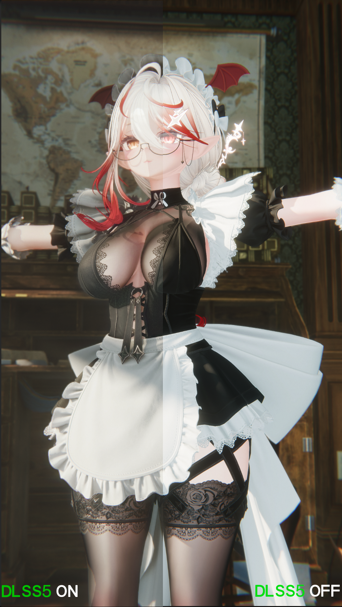
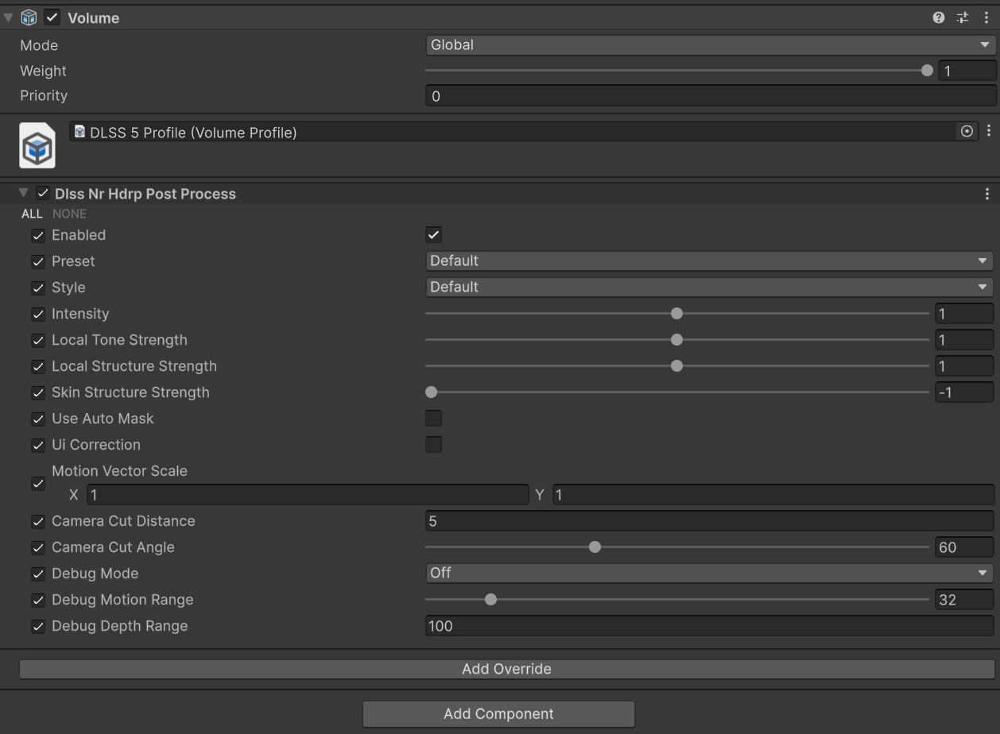

# Unity HDRP DLSS-NR

## 中文说明

这是一个面向 Unity HDRP 的 NVIDIA DLSS Neural Rendering 集成。它以 HDRP 正式
Custom Post Process Volume 运行，不需要 Renderer Feature，也不需要 Custom Pass。

### 功能

后处理从 HDRP 相机获取光栅颜色、深度和运动向量，交给 UnityRHI DLSS-NR 原生运行时，
再写回 HDRP 后处理链。当前版本按相机实际尺寸进行 1:1 输出，用于神经图像增强和
时域重建。它不是 DLSS Super Resolution、Frame Generation 或 Ray Reconstruction，
也不会生成另一张光线重构图。

### 效果对比

下图为 DLSS-NR 开启与关闭时的画面对比示例：



### 前置依赖

| 依赖 | 要求 | 地址 |
| --- | --- | --- |
| Unity | Unity 6.3 或更高版本 | [Unity 版本下载](https://unity.com/releases/editor/archive) |
| HDRP | HDRP 17 或更高版本，启用 RenderGraph | [HDRP 文档](https://docs.unity3d.com/6000.3/Documentation/Manual/com.unity.render-pipelines.high-definition.html) |
| UnityDLSSNR | 上游 UnityRHI managed/native 包，本仓库依赖它 | [Kuan-Mi/UnityDLSSNR](https://github.com/Kuan-Mi/UnityDLSSNR) |
| Managed 包 | `top.kuanmi.unityrhi` | [最新 Release](https://github.com/Kuan-Mi/UnityDLSSNR/releases/latest) |
| Native 包 | `top.kuanmi.unityrhi.native`，必须嵌入项目 | [native 1.0.0 下载](https://github.com/Kuan-Mi/UnityDLSSNR/releases/download/v1.0.0/top.kuanmi.unityrhi.native-1.0.0.zip) |
| NVIDIA | 支持 DLSS-NR 的 NVIDIA GPU、驱动和匹配的原生运行时 | [NVIDIA DLSS](https://developer.nvidia.com/dlss) |

平台仅支持 Windows x64 + Direct3D 12；不支持 D3D11、macOS、Linux 或非 NVIDIA 设备。

### 安装

1. 将本仓库的 `Core`、`HDRP`、`Shaders` 复制到目标项目的 `Assets/Plugins/DLSS 5`。
2. 安装 `top.kuanmi.unityrhi` managed 包。
3. 下载并解压 native 包到：

   ```text
   Packages/top.kuanmi.unityrhi.native
   ```

   native 包必须位于目标项目 `Packages` 下，不能直接引用外部 `Build` 文件夹；请自行
   通过合法、可信的渠道获取与驱动匹配的 NVIDIA DLSS-NR 原生运行时，并按上游项目
   的说明放入该包的插件目录。本仓库不包含、不分发也不提供泄露的 NVIDIA 二进制文件。
4. 在 **Edit > Project Settings > Player > Other Settings** 设置 **Direct3D 12**，
   重启 Unity。
5. 在 **Edit > Project Settings > Graphics > HDRP Global Settings** 的
   **Custom Post Process Orders > After Post Process** 添加：

   ```text
   UnityRhi.DlssNr.Hdrp.DlssNrHdrpPostProcess
   ```

6. 在 Volume Profile 中选择 **Add Override > Post-processing > DLSS Neural Rendering**，
   勾选 **Enabled** override 并打开。确认 HDRP 相机启用 Depth 和 Motion Vectors。

Volume 面板示例：



本实现不要求开启动态分辨率，输入和输出均为当前相机实际尺寸。

### 参数与相机行为

- **Preset / Style**：神经渲染配置。
- **Intensity、Local Tone Strength、Local Structure Strength、Skin Structure Strength**：增强强度。
- **Motion Vector Scale**：运动向量到像素单位的换算。
- **Camera Cut Distance / Angle**：触发时域历史重置。
- **Use Auto Mask / UI Correction**：转发给 DLSS-NR 的选项。
- **Debug Mode**：查看运动向量、运动幅度、设备深度或线性眼空间深度。

Game 相机使用完整 DLSS-NR 路径。SceneView 当前直接显示 HDRP 原图（pass-through），
不执行 native DLSS-NR，以避免编辑器相机缺少稳定时域历史导致灰屏、黑屏或闪烁。因此
SceneView 不保证显示与 Game 窗口相同的 DLSS 效果，请在 Game 窗口或构建版本确认。

每个相机拥有独立 native context 和时域历史；分辨率、投影、相机切换或 Volume 参数
变化时会自动重置历史。

### 输入接口

当前 native dispatch 接收 `Color`、`Depth`、`MotionVectors`、输入/输出宽高、运动向量
缩放、深度反转、Reset、Preset/Style 以及强度参数。Normals、roughness、albedo、
reactive mask、exposure texture 和 ray-tracing buffers 不属于当前路径。

### 排错

- 黑屏/灰屏：确认 D3D12、native 包路径、合法获取的原生运行时、Global Settings 注册和 Volume Enabled。
- Console 出现 URP `Core.hlsl`、`TextureDimension` 或 D3D11 错误：说明仍有旧 URP 文件或使用了错误图形 API。
- 画面裁切/偏移：检查 Game View 宽高比、相机 viewport 和 RTHandle scale，不要使用 backing texture 尺寸。
- 没有明显效果：DLSS-NR 是 1:1 增强，不是超分辨率；请在高频细节、运动和 Debug Mode 下比较。

### 相关地址

- [Unity Custom Post Process](https://docs.unity3d.com/Packages/com.unity.render-pipelines.high-definition@17.0/manual/Custom-Post-Process.html)
- [Unity Volume 系统](https://docs.unity3d.com/Manual/Volumes.html)
- [NVIDIA NGX](https://developer.nvidia.com/rtx/ngx)
- [本项目仓库](https://github.com/QingyuanSTUDIO/Unity-HDRP-DLSS5-NR)

### 许可证

本仓库包含 Unity HDRP 集成层。UnityRHI、DLSS/NGX 原生运行时及 NVIDIA 组件受各自
作者和 NVIDIA 许可、分发条款约束。原生运行时需要用户自行通过合法渠道获取；本仓库
不包含、不分发或链接任何泄露的 NVIDIA 二进制文件。

## English

This repository integrates NVIDIA DLSS Neural Rendering into Unity HDRP as a regular
HDRP Custom Post Process Volume. It does not require a Renderer Feature or Custom Pass.

The effect reads the raster camera color, depth, and motion-vector buffers, sends them to
the UnityRHI DLSS-NR runtime, and writes the result into HDRP's post-process chain. The
current implementation is 1:1 at the camera's actual resolution. It is neural enhancement
and temporal reconstruction, not DLSS Super Resolution, Frame Generation, or Ray Reconstruction.

Example comparison (DLSS-NR on/off):


### Requirements and links

- Unity 6.3+: [Unity archive](https://unity.com/releases/editor/archive)
- HDRP 17+ with RenderGraph: [HDRP manual](https://docs.unity3d.com/6000.3/Documentation/Manual/com.unity.render-pipelines.high-definition.html)
- Upstream managed/native dependency: [Kuan-Mi/UnityDLSSNR](https://github.com/Kuan-Mi/UnityDLSSNR)
- Managed package: [latest release](https://github.com/Kuan-Mi/UnityDLSSNR/releases/latest)
- Native package: [top.kuanmi.unityrhi.native 1.0.0](https://github.com/Kuan-Mi/UnityDLSSNR/releases/download/v1.0.0/top.kuanmi.unityrhi.native-1.0.0.zip)
- NVIDIA DLSS runtime information: [NVIDIA DLSS](https://developer.nvidia.com/dlss)
- Platform: Windows x64, Direct3D 12, supported NVIDIA GPU/driver.

### Installation

Copy `Core`, `HDRP`, and `Shaders` into `Assets/Plugins/DLSS 5`; install
`top.kuanmi.unityrhi`; and embed the native package at
`Packages/top.kuanmi.unityrhi.native`. Obtain the matching NVIDIA native runtime
separately from a legitimate source and place it according to the upstream package
instructions. This repository does not include, redistribute, or link to leaked binaries.
Use Direct3D 12 and restart Unity. In **HDRP Global Settings > Custom Post Process Orders >
After Post Process**, add `UnityRhi.DlssNr.Hdrp.DlssNrHdrpPostProcess`. Add the **DLSS Neural
Rendering** Volume override and enable its **Enabled** override. HDRP depth and motion vectors
must be available. Dynamic resolution is not required.

Example Volume panel:


Game cameras run the full path. SceneView is intentionally pass-through because editor cameras
do not provide stable runtime temporal history. Check the Game view or a player build for the
actual effect. Common failures are wrong graphics API, a non-embedded native package, missing
DLL, an unregistered custom post process, or a disabled Volume override.

The NVIDIA native runtime must be obtained separately through a legitimate source. This
repository does not include, redistribute, or link to leaked NVIDIA binaries. NVIDIA runtime
components remain subject to NVIDIA licensing and redistribution terms.
